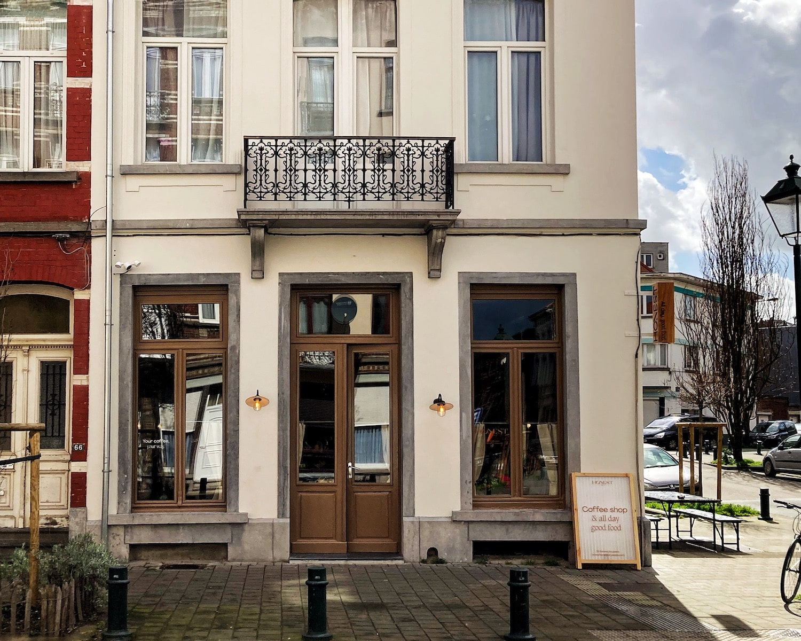
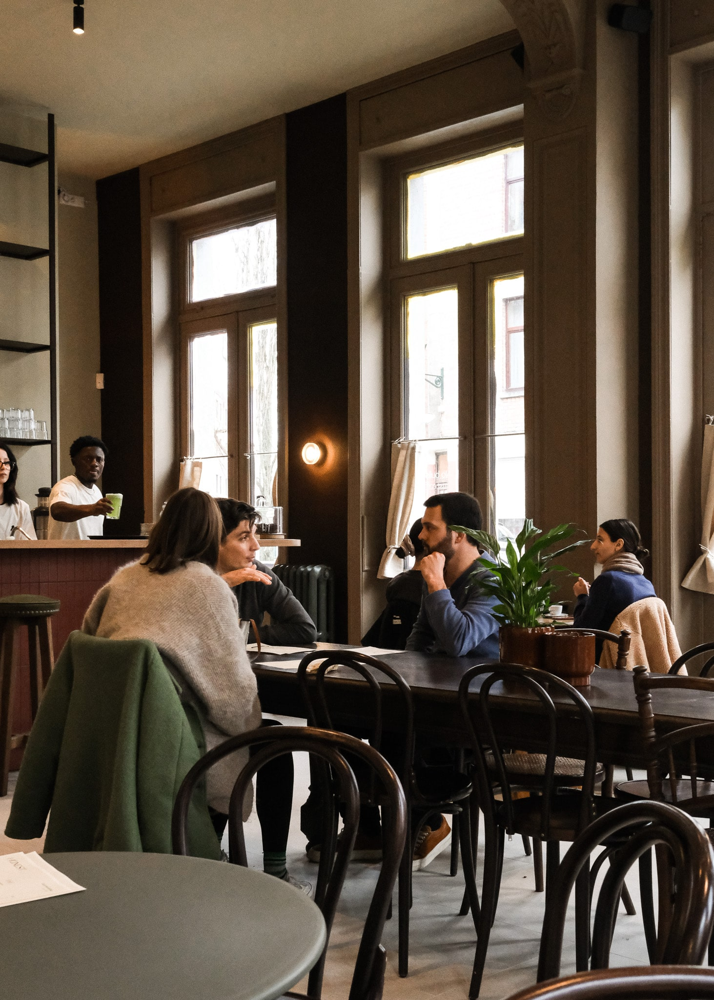
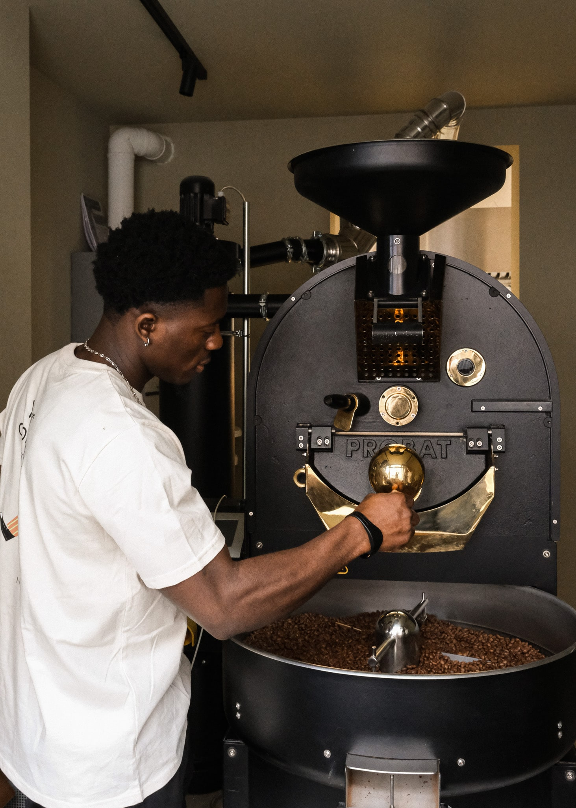

Vous ne trouverez pas Honest dans l'une des rues touristiques de Bruxelles. Ils ont ouvert les portes de leur café dans une partie de la ville où personne n'avait osé s'aventurer auparavant. Ce qui se démarque immédiatement à l'arrivée, c'est la simplicité et la discrétion de la façade du bâtiment. Il n'y a pas d'enseigne imposante annonçant le café, mais plutôt de petits détails subtils comme des lampes allumées à l'extérieur, des lettres sur les fenêtres et une signalisation en bois sur le côté du bâtiment, indiquant qu'il y a quelque chose d'intrigant à l'intérieur.

Dès que vous entrez, vous ressentez immédiatement l'atmosphère d'un bistrot belge moderne. Des éléments originaux tels que des moulures au plafond et des portes battantes ont été préservés et habilement intégrés à la décoration, préservant l'âme du bâtiment. Le studio de design, etudes.architecture, a apporté une touche de modernité avec des meubles tels que le bar carrelé en rouge et l'étagère métallique derrière lui, présentant des verres, ainsi que le détail excentrique du papier peint en marc de café. Il n'est pas étonnant que les résidents locaux aient été conquis dès le premier jour, comme le partage Elodie : "Nous avons ouvert la porte, et les gens du quartier sont venus le premier jour même avant l'ouverture officielle. Et ils disent tous la même chose, que cela manquait dans le quartier."

En plus d'être un restaurant, Honest abrite également une torréfaction, un ajout crucial sans lequel le projet n'aurait pas pu voir le jour. Pendant le confinement, Cécile a suivi une formation en torréfaction à Copenhague et a continué à explorer ce domaine à son retour. Il lui semblait naturel de proposer à Elodie de collaborer à l'ouverture d'un lieu qui combine les deux aspects et leur permet de contrôler l'origine et le goût de leur café. Ce pari a porté ses fruits car le café est apprécié aussi bien chez Honest que à La Fabrique en Ville, attirant une clientèle différente, certaines personnes moins familières avec le café de spécialité.

L'objectif est de faire croître la marque avec réflexion, comme le souligne Cécile : "Nous développerons étape par étape, en nous assurant que chaque étape est sécurisée. De cette manière, lorsque nous atteindrons une nouvelle étape, les fondations en dessous seront parfaites. Nous pouvons nous concentrer à 100% sur le nouveau." Les mois à venir seront axés sur la création d'un nouveau mélange de café, plus fruité et plus unique, distinct du "mélange confort" actuel, ainsi que sur l'expansion des ventes en ligne. Il y a aussi le désir de faire croître la marque sans saturer le marché tout en maintenant la même philosophie lors de l'ouverture de nouveaux établissements, permettant à plus de gens de vivre l'expérience Honest. C'est une histoire passionnante à suivre.
