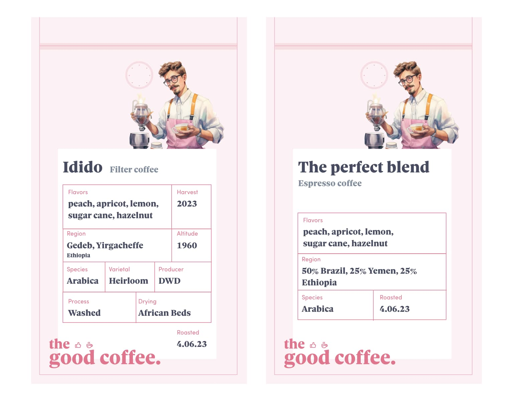
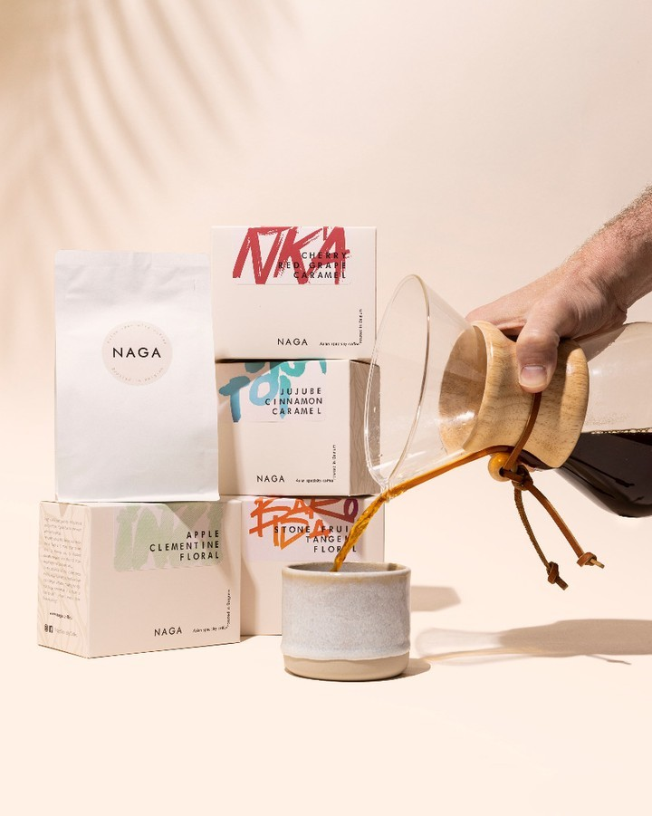

Reconnaître un bon café est réalisable en examinant l'étiquette sur le sac et les diverses informations que vous pouvez et souhaitez y lire. Voici une liste de tout ce qui pourrait être inclus sur une étiquette de café.

## Single origin ou Blend ?

La première décision que vous devrez prendre est entre l'Origine unique et le Mélange. Pour l'instant, souvenez-vous simplement qu'avec l'Origine unique, les grains de café proviennent de la même région du monde et du même producteur ou de la même ferme de lavage. C'est un café de saison, donc vous ne pourrez pas le trouver toute l'année. En revanche, le Mélange est une combinaison de différents grains de café que le torréfacteur a habilement mélangés pour créer un profil de saveur spécifique. Cela signifie qu'à chaque achat de ce café, vous pouvez vous attendre à la même saveur constante dans votre tasse.

## Le nom

Parlons d'un aspect essentiel de votre café : son nom. Le nom servira de référence utile pour vous permettre d'identifier et de localiser facilement votre café préféré.

### Blen

Lors de l'achat d'un mélange, le torréfacteur attribuera un nom à son mélange. Dans la plupart des cas, vous rencontrerez deux types de mélanges : Filtre et Espresso, chacun avec son nom distinct.

### Single Origin

En ce qui concerne le café provenant d'une région spécifique, le nom du café sera toujours lié à ce que vous achetez. Il peut être nommé d'après la région elle-même, la station de lavage, la ferme de café, le producteur, le lot, ou d'autres facteurs pertinents. Le nom servira d'identifiant pour l'origine spécifique et les caractéristiques du café que vous achetez.

## Saveurs

Un aspect essentiel à prendre en compte lors du choix de votre café est le goût. Le défi avec le bon café est que, similaire au vin, chaque café est unique, résultant en des saveurs distinctes. Bien que les mélanges ne mettent pas en avant des saveurs individuelles de manière proéminente, les cafés d'origine unique ont tendance à avoir des profils de saveurs distincts qui sont perceptibles lorsque vous les buvez. Il est important d'avoir une compréhension des saveurs potentielles à l'avance, c'est pourquoi l'emballage inclut souvent des informations sur les saveurs présentes dans le café.

## Traçabilité

De nombreux détails relèvent de cette catégorie, et c'est probablement l'un des aspects les plus cruciaux en matière de café. Un bon café est traçable, ce qui signifie que des informations sur son origine et sa provenance sont facilement disponibles. S'il n'y a aucune information fournie concernant la source du café, il est conseillé de ne pas l'acheter. La traçabilité garantit la transparence et vous permet de prendre des décisions éclairées sur le café que vous achetez.

### Blend

Pour le mélange, la traçabilité sera un peu moins détaillée car plus de grains de café sont impliqués dans la recette. Cependant, vous devriez au moins trouver le pays pour chaque grain utilisé, parfois la région, et éventuellement le ratio présent dans le sac.

### Single Origin

**Région**

Certes, cette information est la plus importante. Vous trouverez le pays d'origine des grains de café, la région, et parfois même la ville.

**Espèce**

Dans le monde du café, deux espèces sont couramment utilisées pour faire du café : Robusta et Arabica. Vous devriez opter uniquement pour le café Arabica. Le Robusta a un goût fort qui peut ne pas être aussi agréable, et il est principalement utilisé par l'industrie du café pour être mélangé avec de l'Arabica. Il est préférable de l'éviter.

**Variété**

Arabica est un terme qui englobe toute une famille d'arbres. Tout comme le vin, au sein de la famille Arabica, vous trouverez différentes variétés d'arbres à café, et ces variétés influencent grandement les saveurs de votre café.

**Altitude**

Les arbres Arabica poussent généralement dans la plage d'altitude de 600 mètres à 2400 mètres. L'altitude à laquelle le café est cultivé a en effet un impact sur la saveur et la richesse du goût que vous pouvez attendre dans votre café. Avoir cette information peut orienter votre choix et vous aider à sélectionner un café qui correspond à vos préférences, ou vous pouvez choisir d'explorer différentes altitudes pour découvrir la gamme de saveurs disponibles.

**Date de récolte**

Le café est un produit qui est meilleur lorsqu'il est frais. Lors de l'examen d'une étiquette, il est idéal de chercher une date de récolte de moins de deux ans. Bien que vous puissiez certainement essayer du café qui est plus vieux que cela, il est important de noter que le résultat du goût peut être imprévisible. La fraîcheur est un facteur clé pour expérimenter les meilleures saveurs et arômes dans votre tasse de café.

**Le producteur**

Enfin, de temps en temps, vous trouverez le nom du producteur sur l'étiquette. Cela indique que votre café provient véritablement d'un endroit spécifique et est associé à un producteur particulier. Avoir le nom du producteur offre un niveau supplémentaire d'authenticité et de traçabilité, vous permettant de vous connecter avec les personnes derrière le café et d'apprécier les caractéristiques uniques des grains.

<figure>
  
  <figcaption>
    Photo par
    <a href="https://naga.coffee/" 
      target="_blank">Naga Specialty Coffee</a>
  </figcaption>
</figure>

## Processus

Pour transformer les cerises de café en les grains de café bien-aimés que nous apprécions, ils doivent subir deux processus principaux : le lavage et le séchage. Bien que nous n'entrions pas dans tous les détails complexes dans cet article, il est important de noter que ces processus peuvent avoir un impact significatif sur le goût de votre café. Les méthodes spécifiques utilisées pendant le lavage et le séchage peuvent influencer le profil de saveur, l'acidité et les caractéristiques générales des grains. Il vaut la peine de considérer comment ces processus contribuent à l'expérience gustative finale lors de l'exploration de différentes options de café.

## Filtre ou Espresso?

Dans la plupart des cas, le café est classé en deux types principaux : filtre et espresso. Cette classification reflète en fait le niveau de torréfaction du café. Le café filtre correspond généralement à une torréfaction légère, tandis que le café espresso est généralement torréfié foncé. Il est généralement recommandé d'utiliser du café filtre avec des techniques d'infusion lente, telles que le versement ou la presse française, et du café espresso avec une machine à espresso. Cependant, il est important de noter que vous n'êtes pas strictement limité à ces directives. Vous pouvez toujours utiliser du café filtre dans une machine à espresso, bien que le profil gustatif puisse différer de ce à quoi vous vous attendez généralement. En fin de compte, le choix de la torréfaction et de la méthode d'infusion est une question de préférence personnelle, et vous pouvez expérimenter pour trouver la combinaison qui convient le mieux à votre goût.

## Date de torréfaction

L'une des informations les plus cruciales, et une exigence minimale, est d'avoir la date de torréfaction sur le café que vous achetez. De plus, il peut être bénéfique d'avoir une date de consommation maximale suggérée. La période optimale pour savourer votre café est généralement du 7e jour après la torréfaction jusqu'au troisième mois après la torréfaction. Bien que vous puissiez toujours utiliser du café au-delà de trois mois, il est important de noter que la qualité du goût diminuera progressivement avec le temps. Par conséquent, pour la meilleure expérience de saveur, il est recommandé de consommer le café dans le délai spécifié.

 

Vous ne trouverez peut-être pas toutes les informations mentionnées sur chaque emballage de café, car cela peut être assez étendu. Cependant, les détails minimums à rechercher sont les origines du café, la date de torréfaction et les notes de saveur.

Si vous avez besoin d'aide pour trouver des endroits où acheter du café, gardez à l'esprit que [nous avons créé une carte](https://the-good-coffee-places.com/) où vous pouvez localiser d'excellents cafés qui non seulement servent du café, mais offrent également des grains de café à vendre.

Enfin, si vous avez une marque de torréfacteur de café préférée, vous pouvez souvent acheter leur café directement sur leur site web. Cela vous permet d'accéder à une large gamme de leurs offres de café et de les faire livrer commodément à votre porte. Avec les connaissances acquises sur les origines du café, les dates de torréfaction, les saveurs et d'autres facteurs, vous serez bien équipé pour naviguer plus facilement dans le processus d'achat de café. Bonne chasse au café !
