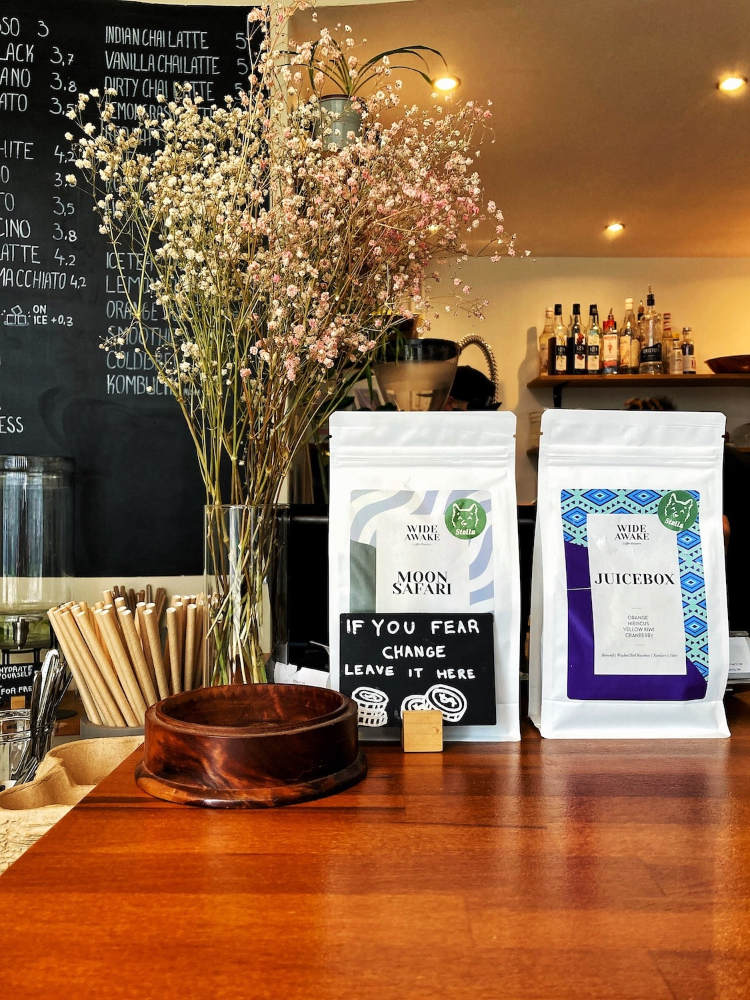
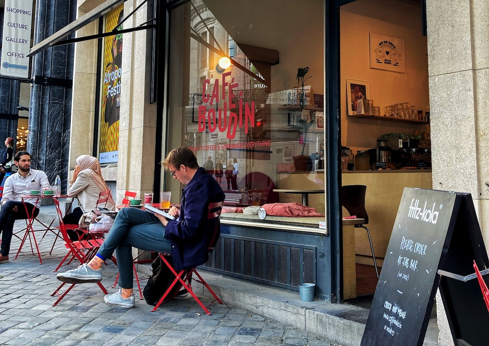

## 1. Pas excessivement commercialisé

Prenant une référence de la nature et de ses belles créatures, plus elles sont brillantes à l'extérieur, plus elles sont venimeuses à l'intérieur. Nous avons tous des exemples de marques qui nous viennent à l'esprit en pensant à des cafés où tout semble faux et forcé : de grandes images de grains de café sur le mur, beaucoup de marchandising marketing à acheter, beaucoup d'enthousiasme pour l'endroit, la file d'attente bien organisée pour s'assurer que vous passerez devant tout ce qu'ils ont à offrir avant de passer votre commande, des boissons trop chères, et ainsi de suite...

Les cafés que vous voulez repérer sont les petits, ceux que vous remarquez à peine depuis la rue où les baristas et les serveurs semblent heureux de travailler, où ils ont fait ce qu'ils pouvaient avec l'endroit sans adapter leur design à la pièce. Souvent, ces endroits sont faits pour que vous puissiez vous détendre à l'intérieur, prendre votre café et le boire confortablement installé dans le meilleur canapé du monde. Vous voudrez emmener ce canapé chez vous. Il y a un sentiment d'accueil, et on a l'impression d'être entré dans un endroit où les gens veulent que vous restiez. C'est le genre d'endroit que vous voulez essayer de repérer.

En résumé, le brillant et le coloré devraient courir comme l'enfer. Doux, confortable et confortable comme un salon danois, vous êtes au bon endroit.

Et ouais, j'ai oublié un détail majeur : les mots "Café de spécialité" écrits quelque part sur un tableau ou sur le menu.

## 2. Des marques de café que vous n'avez jamais entendues parler ou dans un cercle proche

La deuxième étape lorsque vous entrez dans un bon café est d'essayer de déchiffrer le menu. Oui, vous savez ce qu'est le café, et vous pourriez même connaître la différence entre un cappuccino et un latte. Mais quel est donc le nom du café qui est servi ? Parfois, vous devrez même choisir entre deux cafés différents lorsque vous commandez votre boisson. Ça, mon ami, c'est la preuve que vous êtes entre de bonnes mains. Avoir le choix entre deux types de café et une multitude de façons d'avoir votre café - V60, Chemex, French Press, etc. - est le meilleur indicateur que vous êtes au bon endroit. Et si vous ne savez rien sur les grains de café et que personne n'est là pour vous guider, alors...

## 3. ... le barista sait de quoi il parle et peut répondre à vos questions

Oui. Le barista doit être un expert dans l'art du café. Pour la plupart, ce sont des professionnels bien formés et leur rôle n'est pas seulement de créer de belles œuvres d'art avec le lait. Pensez à eux comme à un barman qui confectionne vos cocktails le vendredi soir. Cette personne créera le meilleur café selon votre goût. Alors allez-y, laissez-les prendre votre main et vous guider dans le monde magique du café. Ils pourraient même être capables de vous surprendre, comme cela m'est arrivé la dernière fois qu'un barista m'a offert une dégustation d'un latte rouge, ce qui était une boisson assez incroyable !

S'ils ont le temps, ils pourraient même être capables de vous expliquer la différence entre les grains utilisés dans le café, car il y a une différence. Un peu comme le vin, le café n'a pas le même goût s'il vient d'un certain pays et d'une certaine région, et comment il a été nettoyé, séché, puis torréfié. C'est tout un processus, et le barista est là pour le sublimer. Par conséquent, ils devraient être capables de vous dire pourquoi choisir l'un plutôt que l'autre.

## 4. Le rythme pour que votre café arrive

Êtes-vous pressé ? Désolé de l'apprendre. Je sais que dans le monde d'aujourd'hui, tout va plus vite. Vous pouvez avoir ce que vous voulez, quand vous le voulez, très rapidement. Mais le café, le café prend du temps. Vous ne poussez pas simplement un bouton pour avoir la boisson — eh bien, parfois, dans certains cafés, oui, mais nous ne parlons pas de ceux-là. Tout est assez technique et peut changer d'un endroit à l'autre, mais il faut environ 8 secondes pour moudre ces doux grains de café, 28 secondes pour faire passer l'eau à travers le café et dans votre tasse, et après ça, le temps de chauffer le lait et de le verser, environ 30 secondes de plus. Il faut donc environ une minute pour faire votre café.

Et ça devrait. Le café est une potion qui prend du temps à infuser et à être bien fait. Beaucoup de choses se passent derrière une machine à café, et le barista veut vous donner le meilleur café possible à chaque tasse. Asseyez-vous et détendez-vous, prenez une grande respiration, discutez avec les gens autour de vous, prenez le temps de vous réveiller complètement — oui, nous savons que certains d'entre vous ne sont pas exactement réveillés quand vous venez prendre votre café. Vous êtes entre de bonnes mains, et assez rapidement, vous aurez un bon café entre les mains.

## 5. Dernier acte, le goût

Un bon café a différentes saveurs, donc vous n'aurez jamais le même café deux fois. C'est comme le vin ; chaque année est différente, et la région d'où viennent les grains aura un impact énorme sur votre tasse de café. C'est pourquoi votre café ne peut pas avoir le même goût de temps en temps, et toute personne qui vous dit qu'il ne devrait jamais avoir le même goût de café se trompe.

Et c'est la meilleure partie : chaque tasse que vous buvez est une occasion de tomber amoureux d'un nouveau café, de découvrir de nouvelles saveurs et de voyager vers de nouvelles parties du monde que vous n'avez jamais visitées mais qui sont toutes dans votre tasse. C'est vraiment magique. Mais voici le hic : pour boire un tel café, vous devrez dire au revoir à l'engouement des cappuccinos et des lattes et commencer à boire du long black ou du batch brew. Si le café est bien infusé, il peut avoir le goût d'une très bonne tasse de thé, et vous goûterez toutes les saveurs du café. Assez rapidement, vous aurez vos régions préférées, et vous vivrez pour boire du café de cette partie du monde. Croyez-moi, vous aimerez ça.

 

Et voilà, cela conclut nos 5 points pour trouver de bons cafés. Si vous avez besoin d'un peu d'aide à ce sujet, je suis en train de construire une carte [où vous trouverez certains de ces endroits](https://the-good-coffee-places.com). Alors dépêchez-vous d'y aller et trouvez tous les endroits où vous pourrez boire un bon café. Et si vous connaissez un café qui n'est pas sur la carte, n'hésitez pas à [remplir ce formulaire](https://tally.so/r/wgaBMO) pour me donner des informations à ce sujet. En attendant, j'espère que votre café a le goût du paradis et que vous trouverez de nouveaux cafés autour de chez vous !
