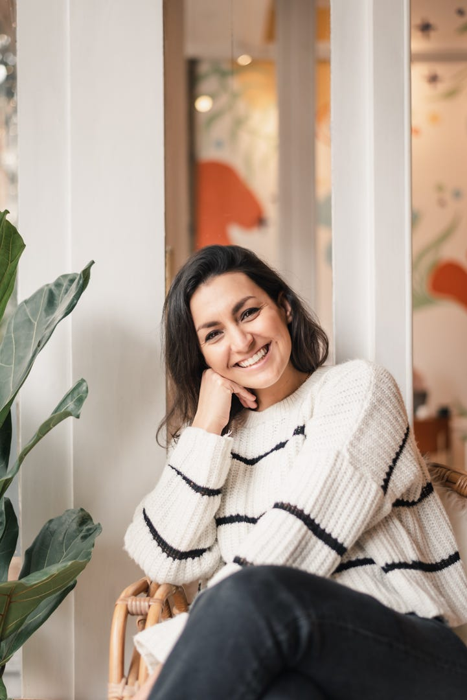
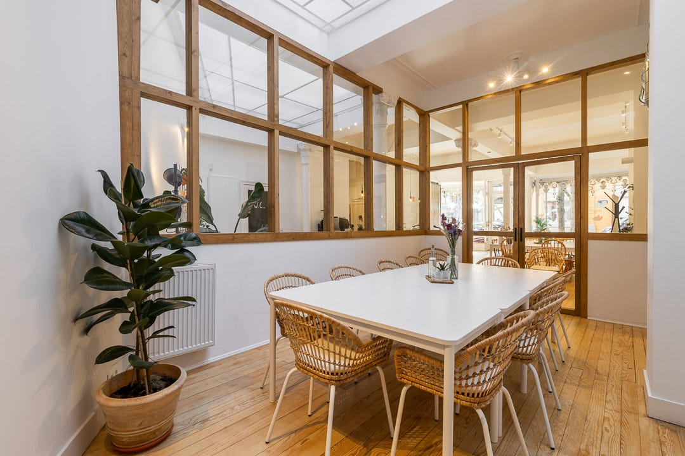
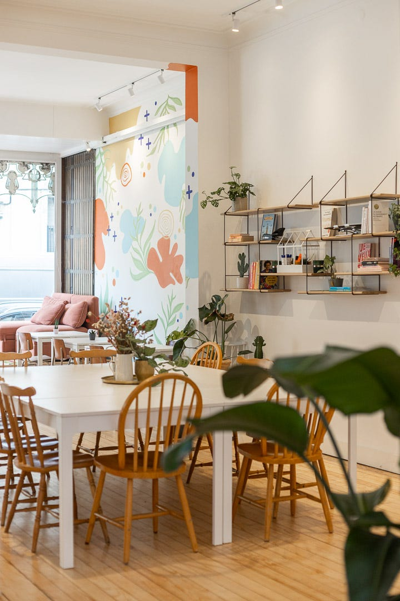
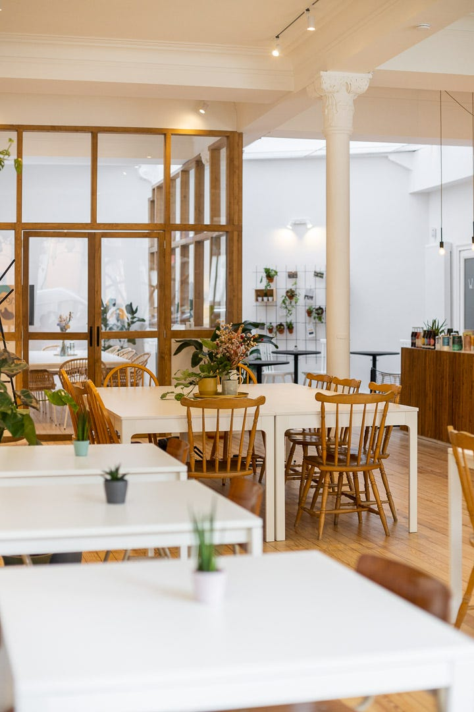
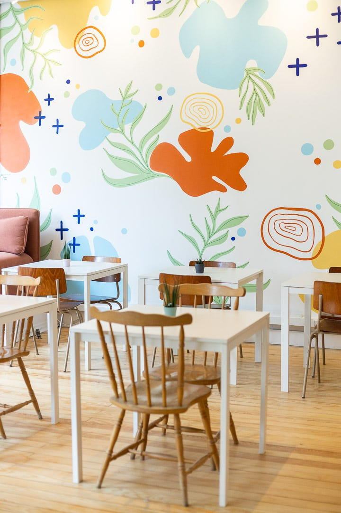

## Quel est ton café préféré ?

Pendant ma formation, j'ai découvert le cortado. J'aime beaucoup les boissons lactées, mais je veux quand même goûter le café.

## Explique le concept. Pourquoi un café coworking ?

Quand j'ai quitté mon emploi, j'ai lancé un site de commerce électronique vendant des tissus de décoration. Des plaids, des coussins, des petits articles de merchandising et bien plus encore. Pendant ce temps, j'ai commencé à chercher des endroits où travailler pour ne pas rester seule à la maison. J'ai essayé les cafés classiques, avec une belle ambiance, des prises pour brancher l'ordinateur et un bon café. Cela semblait être une bonne correspondance.

J'ai rapidement senti que ces endroits n'étaient pas confortables et un peu bruyants. On se retrouve à écouter la conversation à la table d'à côté, incapable de se concentrer. Le wifi est trop faible pour travailler ou ne fonctionne pas du tout. Le mobilier est trop bas pour le dos. Un ami m'a donné une solution : l'espace de coworking.

J'ai essayé les bureaux de coworking à Bruxelles. Les bureaux sont incroyables et bien conçus, mais j'avais toujours l'impression d'être dans un monde corporatif avec peu de travailleurs indépendants. En visitant un fournisseur à Paris, j'ai découvert une nouvelle façon de faire du coworking, un café qui fait aussi office d'espace de coworking.

Pensant à ce que j'ai vu à Paris, j'ai cherché des cafés coworking à Bruxelles et je n'en ai pas trouvé. Prête à créer un lieu et regrettant le contact quotidien avec les gens, j'ai décidé de me lancer et de créer mon propre endroit.

<figure>
  
  <figcaption>
    Photo par
    <a href="https://www.instagram.com/cecile.belhomme/" target="_blank">Cécile Belhomme</a>
  </figcaption>
</figure>

## Qui sont tes clients ?

Beaucoup de travailleurs indépendants, freelancers qui travaillent seuls ou de petites entreprises de deux ou trois personnes. Certains sont des personnes qui travaillent de chez elles. Travailler de chez soi, c'est génial, mais parfois ce n'est pas approprié. Les enfants jouent, des travaux en cours dans la rue, des gens qui passent, il y a un million de raisons pour que ce ne soit pas adapté. Ou bien vous n'avez pas un vrai bureau et vous vous retrouvez à travailler depuis votre lit ou sur le canapé devant la télé.

Parfois, j'ai aussi des étudiants ou des personnes qui lancent leur entreprise. Rencontrer des gens leur donne l'occasion de partager leurs idées et d'obtenir des retours constructifs. Vous pouvez également rencontrer des créatifs, ils viennent ici pour faire leur travail administratif et ne partent pas avant que le travail soit fait.

## Comment as-tu trouvé l'endroit ?

C'était la partie la plus difficile du projet. L'endroit où je suis maintenant, je l'ai trouvé grâce à Abiz, une agence immobilière B2B qui a beaucoup de références pour des endroits à Bruxelles.

Avant cela, je regardais sur Immoweb, un site web immobilier belge célèbre. Je suis devenue une experte. J'ai pu trouver où était l'endroit, l'histoire du bâtiment, l'affectation de l'endroit et qui était là avant. Pendant un bref moment, j'ai pensé à devenir agent immobilier.

J'ai commencé à chercher l'endroit parfait en février 2020, le Covid est arrivé et a tout arrêté. J'ai repris les recherches et j'ai trouvé l'endroit après beaucoup de déceptions ou d'évitements d'erreurs en mars 2021.

## Avais-tu une idée des endroits que tu cherchais ?

Je voulais quelque chose de grand, au moins 100 mètres carrés, avec beaucoup de lumière naturelle et accessible en transport en commun.

Je voulais que ce soit à Schaerbeek, Ixelles, Bruxelles, Saint-Gilles ou Uccle. Et il était obligatoire que ce soit une affectation "Food & Beverage". Nous servons du café et de la nourriture, et je ne voulais pas avoir de problème avec cela.

<figure>
  
  <figcaption>
    Photo par
    <a href="https://www.instagram.com/giorgiokavadias" target="_blank">Giorgio Kavadias</a>
  </figcaption>
</figure>

## Alors, quelle est la taille de cet endroit ?

C'est 130 mètres carrés, mais avec de petites pièces sur le côté : les toilettes, la cuisine et la petite salle de réunion. Il y a environ 90 mètres carrés accessibles au public.

## Qu'est-ce que tu aimes le plus dans cet endroit ?

La lumière, le comptoir en bois et la verrière. Quand j'entre le matin, j'aime voir la lumière qui passe par les fenêtres.

## Combien de temps a pris le lancement du projet ?

En septembre 2019, j'ai eu l'idée, j'ai rejoint Crédal, une structure de soutien qui aide à lancer une idée. L'endroit a ouvert le 25 octobre 2021.

Je suppose que ça aurait pu être plus rapide, mais la recherche d'endroit et le Covid ont freiné le projet. Nous avons mis beaucoup de pression sur les travaux intérieurs. Nous avons commencé à détruire des murs en juin 2021 et avons terminé en septembre.

Mais la partie la plus chronophage a été l'aspect administratif. Il faut attendre la visite des pompiers et envoyer un document à la mairie. Et ensuite, il faut attendre d'obtenir un document officiel qui dit que l'on peut ouvrir l'endroit. J'ai attendu 3 semaines pour l'obtenir.

<figure>
  
  <figcaption>
    Photo par
    <a href="https://www.instagram.com/giorgiokavadias" target="_blank">Giorgio Kavadias</a>
  </figcaption>
</figure>

## Quels problèmes as-tu rencontrés en cours de route ?

Évidemment, la recherche de l'endroit. La conception de l'endroit était un défi. Il est difficile d'imaginer quelque chose dans ta tête puis de l'expliquer à l'entrepreneur. Tu as des idées pour les murs et le sol, mais comme tout est protégé pour les travaux en cours, tu ne sais pas si tout fonctionnera bien ensemble. C'est stressant.

## Si tu devais le refaire, chercherais-tu de l'aide pour cette partie ?

Peut-être. J'aime concevoir un espace, c'est amusant. J'ai eu de la chance parce que le bâtiment était déjà joli, au final, j'ai seulement placé des meubles. Il est vrai que je n'ai pas créé un espace à partir de rien. À l'avenir, si je veux créer un deuxième endroit, je pourrais demander à quelqu'un de le faire, de cette façon je pourrais préserver l'identité de l'endroit. Et si j'ai l'argent...

## Quel est ton budget final pour l'endroit ?

Je ne me suis jamais vraiment arrêtée sur les chiffres, je dirais environ 60 000€. Rénovation, mobilier et tout ce dont j'ai besoin pour faire fonctionner l'endroit, j'ai acheté certaines choses dans des magasins de seconde main, comme le frigo.

## Quelle était ton inspiration pour l'endroit ?

Je suis allée dans d'autres endroits. Chaque fois, j'essayais de ressentir ce que j'aimais là-bas. Qu'est-ce que j'aimais dans l'endroit ? Était-ce les couleurs, les meubles, l'atmosphère ? Et aussi ce qui crée un endroit où je me sens bien : le bois et les plantes, par exemple.

J'ai hésité pendant longtemps à introduire des couleurs. J'aime les couleurs vives utilisées en Colombie et au Mexique, vives, bien équilibrées et mélangées. Mais je ne me sentais pas confiante de le faire seule. J'ai également trouvé des idées sur Pinterest et peu à peu tout s'est mis en place. C'est une sensation formidable de regarder ce que tu as sauvegardé comme inspiration et de voir ce que tu as accompli.

<figure>
  
  <figcaption>
    Photo par
    <a href="https://www.instagram.com/giorgiokavadias" target="_blank">Giorgio Kavadias</a>
  </figcaption>
</figure>

## Ton expérience dans le commerce électronique t'a-t-elle aidée à construire l'endroit ?

Oui et non. Cela m'a donné l'occasion de découvrir de nouvelles marques et comptes. Mais au final, je l'ai fait avec un petit budget. Quand j'ai commencé à meubler l'espace, nous étions en 2021, et, comme tu le sais, tout le commerce était en rupture de stock pour beaucoup de choses. J'ai commandé des meubles chez Ikea, puis je suis allée dans les magasins d'occasion pour trouver des chaises, des assiettes, des vases, le tapis,... mon comptable n'était pas content ! Mais cela donne un côté authentique à l'endroit.

## As-tu cherché de l'aide externe pour le lancement ?

Petit. Budget. Moins je dépensais, mieux c'était. Je suis plutôt pessimiste et comme je suis toute seule, je voulais maintenir l'investissement aussi bas que possible.

J'ai répondu à une école de design graphique qui cherchait un vrai projet sur lequel travailler. J'ai présenté mon idée à une classe de 10 étudiants avec une seule fille. Ils devaient trouver un nom pour le projet et, chose amusante, ils ont tous accepté le nom Nomad. J'avais déjà choisi le nom mais ne l'avais pas donné.

Ils ont travaillé sur le logo et ils ont tous proposé une cabine, une yourte et une tente, sauf la fille. Elle avait l'idée des taches colorées que j'utilise pour décrire les différentes activités de Nomad. C'est inestimable pour la communication. Le M décrit le mouvement, les montagnes, les dunes et les voyages. Et elle a décrit l'étoile comme l'étoile du Nord qui guide. J'ai beaucoup aimé !

Mon comptable est un ami qui est intervenu au début du projet. De cette façon, la stratégie fiscale de l'entreprise était en amont, tout était déjà anticipé avant même que j'ouvre.

[Subsiconseils](https://www.subsiconseils.be/). Ils disent être des "Chasseurs de primes", ils trouvent les primes d'État que tu pourrais avoir. Je savais que j'aurais pu en avoir, mais j'étais un peu trop paresseuse pour faire toute la paperasse pour les obtenir. Cela m'a beaucoup aidé.

Thomas de [Ok coffee](http://okcoffee.tips/) m'a aidée avec le café. Je commande le café chez son fournisseur, [Or Coffee](https://orcoffee.be/), et il m'a aidée à choisir ma machine à café. Quand tu lances un café, la première marque qui te vient à l'esprit est Marzocco, mais c'était un peu cher pour moi. J'ai opté pour la marque La Nueva Era. Le gars qui les vend est en Belgique et je peux l'appeler en cas de problème. Je ne fais pas beaucoup de café pendant la journée et ça ne me servirait à rien d'avoir une machine à espresso chère.

## Quels conseils donnerais-tu à quelqu'un qui veut lancer un café ?

Travaille dans un endroit de restauration avant pour savoir à quoi cela ressemble. Pense à ton espace derrière le comptoir et dans la cuisine. Je ne l'ai pas fait et parfois, je souhaite y avoir consacré plus de temps. Garde à l'esprit que tu vas grandir et avoir de l'espace pour t'étendre. Achète des meubles et du matériel pour durer. Tu ne veux pas les changer souvent.

Quand tu lances, fais-le étape par étape. Ne cherche pas à lancer tout en une fois. J'ai essayé de faire le déjeuner et chaque week-end, je stressais à propos de ce qu'il fallait cuisiner, si j'avais assez de matériel, etc... Tu n'auras pas tout le matériel au début du projet et c'est normal. Quand tu achètes "au cas où", tu te retrouves avec beaucoup de choses que tu n'utilises pas. Tu découvriras les besoins des utilisateurs lorsque tu auras des utilisateurs. Prends d'abord le temps de te faire connaître des voisins et d'avoir des clients. Si tu te stresses pour avoir tout aussi parfait que possible, tu seras démoralisé avant le lancement.

Prends des photos professionnelles, dès le début. Partage les coulisses et parle de ce qui se passe. Les gens aiment voir comment un projet évolue et voir le avant-après.

<figure>
  
  <figcaption>
    Photo par
    <a href="https://www.instagram.com/giorgiokavadias" target="_blank">Giorgio Kavadias</a>
  </figcaption>
</figure>

## Quelle est ta motivation pour sortir du lit ?

Rencontrer de nouvelles personnes. Je ne suis pas du matin et savoir que je vais rencontrer de nouvelles personnes est génial. C'est toujours une surprise, tu ne sais jamais qui tu vas rencontrer.

## Trouves-tu un équilibre entre vie professionnelle et vie personnelle ?

Au début du projet, pas du tout. J'ai un enfant et un mari. Il y avait beaucoup à faire, j'étais toujours ici pendant la semaine et le week-end, je devais chercher des meubles ou faire des petits travaux,... J'ai commencé à me sentir coincée dans mon propre endroit. C'est un sentiment partagé par beaucoup de gens qui gèrent un endroit, surtout quand tu es seul. Tu dois être là toute la journée, tu ne peux pas prendre une pause déjeuner pour manger avec des amis. Et il devient difficile de conserver l'amour que tu avais pour ton projet.

Pour lutter contre cela, j'ai décidé de ne travailler que 4 jours par semaine. Le vendredi, quelqu'un d'autre s'occupe de l'endroit. Cela me donne l'occasion d'accompagner mon enfant à l'école, de travailler sur d'autres projets, de faire de petits travaux et de passer du temps de qualité avec mon enfant après l'école.

Je trouve un équilibre en prenant moins de temps pour fermer, mon objectif chaque soir est d'être chez moi le plus tôt possible. Mon week-end est dédié à ma famille, sauf s'il y a un événement à Nomad. Ma famille calibre son temps en fonction de Nomad. Cela aide que mon mari soit assez flexible et travaille à domicile. Mais ma vie sociale a fortement chuté.

## Quelque chose dont tu parles peu, c'est le fait que tu essaies d'être zéro déchet. Pourquoi cela ?

Je n'en parle pas parce qu'aujourd'hui, ce n'est plus une valeur mais plutôt un devoir. C'est la norme, c'est ce que les gens recherchent, tu respires, tu bois de l'eau et tu prends soin de la planète.

J'essaie d'être zéro déchet et ce n'est pas si facile. Je distribue le marc de café à mon voisin pour ses plantes. Si un fournisseur ne peut pas livrer dans des contenants réutilisables, je ne fais pas affaire avec lui. Je travaille avec [Billie cup](https://billiecup.com), une tasse réutilisable que tu peux échanger contre n'importe quel café qui les utilise. Je donne les restes à [Too Good To Go](https://www.toogoodtogo.com). Le merchandising est écologique et tous les fabricants sont locaux, belges ou tiennent compte de l'impact de leur produit. Pour cela, je travaille avec [Teroirist](https://www.instagram.com/terroirist_bxl) qui connaît le marché. Une partie du mobilier est de seconde main.

Certaines choses sont plus difficiles à mettre en œuvre. Par exemple, je voulais utiliser des serviettes dans les toilettes. Mais, si je veux les utiliser, je dois avoir une serviette par utilisation et je ne suis pas sûre que ce soit plus écologique que d'utiliser du papier.

Je le fais autant que possible car c'est la base de tout maintenant et tu ne peux pas le vendre comme faisant partie de qui tu es.
